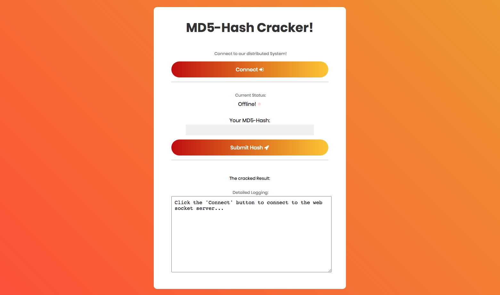

# <font size="8">Distributed Computing | Project</font>
## By Team 3 - ITM18,SS20

### <font size="5"><u>Abstract</u></font>
<font size="3">
Distribute work using a message broker to more than three different types of workers. The workers are coded in different programming languages. A (mobile) web frontend for input and output is connected to a web server and handles live updates via web sockets.

### <font size="5"><u>The Approach</u></font>
* **Problem**: Use a distributed-system to crack a Message-Digest-Hash (MD5)

* **Solution**: 
  * Create a Browser Frontend to enter the MD5-Hash
  * Create a NodeJS Server as Backend for the Webserver
  * Establish an open web socket connection
  * Send the input as a message to the WebSocket Server (NodeJS)
  * Send to encoded message to the RabbitMQ message broker
  * Let the hash be cracked by two different Consumers (JS & Python Brute Force)

### <font size="5"><u> Prerequisites </u></font>

* Requires:
 * Node and NPM installed
 * rabbitmq (optional: admin access and web interface plugin enabled/configured  ```rabbitmq-plugins enable rabbitmq_management```, ```rabbitmqctl add_user fhadmin s3crEt```, ```rabbitmqctl set_user_tags fhadmin administrator```)
 * python3
 * requirments.txt


### <font size="5"><u> Run </u></font>

* In separate terminals 

  * Startup RabbitMQ ```rabbitmq-server``` (optional: ```rabbitmqctl status```)

  * Startup Worker ```./consumer.py```, ```./consumer.js``` and ```./database-consumer.py```

  * Startup front end server ```node server.js```
 
* Open in your browser: <http://127.0.0.1:5555>
  
  * paste a hash e.g. ```53dc0a1e33c70ed4ccd7d3b9195933c8 ``` and send... then watch worker output on console




